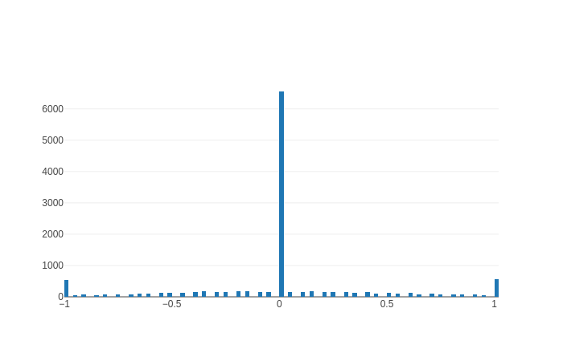
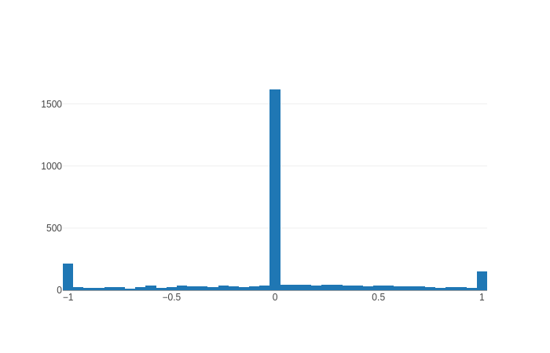
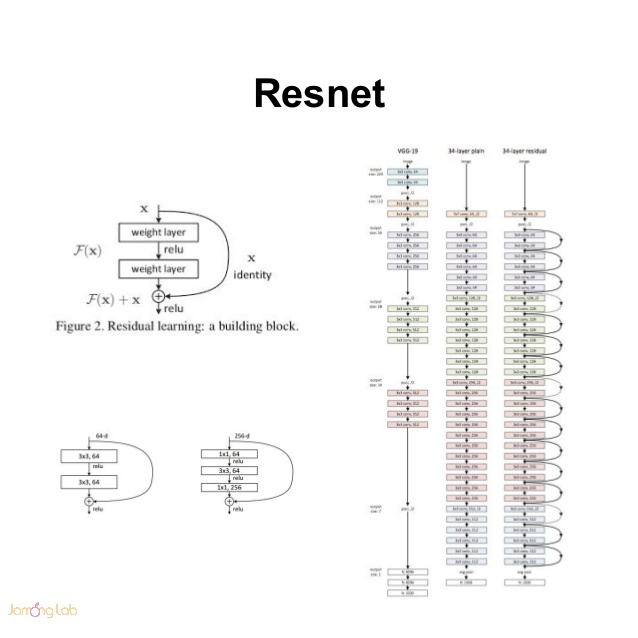

# **Behavioral Cloning** 

**Giving corrct data to resnet, it can achieve state-of-art result without any tricks**

### Overview

The goals / steps of this project are the following:
* Use the simulator to collect data of good driving behavior
* Build, a convolution neural network in **pytorch** that predicts steering angles from images
* Train and validate the model with a training and validation set
* Test that the model successfully drives around track **two** without leaving the road
* Summarize the results with a written report


[//]: # (Image References)

[image1]: ./examples/placeholder.png "Model Visualization"
[image2]: ./examples/placeholder.png "Grayscaling"
[image3]: ./examples/placeholder_small.png "Recovery Image"
  
[image4]: ./examples/placeholder_small.png "Recovery Image"
[image5]: ./examples/placeholder_small.png "Recovery Image"
[image6]: ./examples/placeholder_small.png "Normal Image"
[image7]: ./examples/placeholder_small.png "Flipped Image"


### requirement
If you want to re-implement my result, you should `install` [pytorch](http://pytorch.org/). It is very simple to install pytorch in python3 in linux with cuda 8.0:
```python
pip3 install http://download.pytorch.org/whl/cu80/torch-0.2.0.post3-cp35-cp35m-manylinux1_x86_64.whl 
pip3 install torchvision
```

### File expansion


My project includes the following files:
* sample.py containing the script to test for the automode 
* model.py containing the script to create and train the model
* drive.py for driving the car in autonomous mode
* model.pkl containing a trained convolution neural network 
* writeup_report.md or writeup_report.pdf summarizing the results

### How to run model
```python
cd mysubmition_dir/
python drive.py model.pkl
```

### Implementation
******
####Data Statistics
The dataset consists of 36636 images which are all from track two. Let's compare training and validation distribution:

training:


validation:


It looks almost the same. However, the unbalance label may crash the model.

---


#### 1. Resnet

Resnet is a famous architecture which is used in many field and achieve a huge success. Because
It can be very deep so it can accept a huge number of images without underfitting and at the same time, it will not be overfitting in training data because of `batch normalization` and `dropout layer`. And also it can avoid vanish gradient because of the `residual block`



#### 2. Parameter
Several parameter setting：
`epoch = 30`, `batch_size=256`，`lr=0.0001`.

Because of the input size for resnet is `224`. So I resize my images into the size of `224`.

#### 3. Appropriate training data
The number of the training data is about `36000`. And all of them are collected from track two.
I run 3 laps with clockwise and other 3 laps with Counter-Clockwise. And the car always runs in the middle.

And I apply the same strategy to **track one**(take six round, three are clockwise and other are counter-clockwise)

#### 4.Experience

- No data augmentation. I tried randomCrop, rotation, randomFlip, Zoom. It showed that it was useless.
- Don't crop the sky. It showed that the sky can help the car remember how to drive in some specific place.
- More data help a lot, instead of do a lot of data augmentation.
- Using all of the camera can achieve success.
- Get more data in specific place when the car suck in that place.

#### 5. Something I got confused
More epoch, less training loss. However, the validation loss is all the same. I am so confused. So I only make the decision base on whether the car the pass the track two or not. Maybe something wrong with my splitting.

#### 6. video
I use resnet model in track one dataset and it performs pretty well at **speed of 30**. And this is the track one [youtube](https://youtu.be/mu6PQ9NEhlw) link.Also you can download the video in 


The car can run at **speed of 30** and passed through all the lap without crashing everything. This is the [youtube](https://youtu.be/ejDKt5MI-fE) link. And you can get the video in this :

